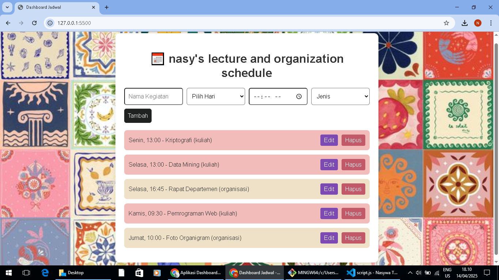

Aplikasi Dashboard Jadwal Kuliah dan Organisasi

# Fungsi dan Fitur-Fitur
Aplikasi ini adalah aplikasi web sederhana berbasis JavaScript untuk membantu dalam mengatur jadwal kuliah dan kegiatan organisasi dalam satu tempat. Dibuat sebagai tugas praktikum JavaScript Next Gen.
Aplikasi ini memiliki fitur-fitur diantaranya:

| Fitur                                                                 | Keterangan                                                                 |
|-----------------------------------------------------------------------|----------------------------------------------------------------------------|
| ✏️ Tambah, Edit, dan Hapus Jadwal                                | Pengguna dapat menambah, mengedit, dan menghapus jadwal kegiatan          |
| 🎨 Warna berbeda untuk dua jenis kegiatan                             | Kuliah berwarna **merah muda**, organisasi berwarna **krem** |
| 📅 Jadwal otomatis diurutkan berdasarkan hari                         | Jadwal ditampilkan berdasarkan urutan Senin → Jumat                       |
| 💾 Data disimpan di localStorage                                      | Jadwal akan tetap tersimpan meskipun browser ditutup atau direfresh       |

# Dokumentasi Aplikasi
Berikut tampilan aplikasi dashboard jadwal yang dibuat.

# Daftar Fitur ES6+ yang Digunakan
| Fitur ES6+            | Contoh Penggunaan                                                             |
|-----------------------|-------------------------------------------------------------------------------|
| `let` dan `const`      | Digunakan untuk deklarasi variabel, seperti `const scheduleManager = new ScheduleManager();` |
| Arrow Functions        | Digunakan di berbagai tempat, seperti `const renderSchedules = () => { ... };` dan callback `.forEach()` |
| Template Literals      | Digunakan untuk menyisipkan variabel ke dalam HTML secara dinamis: `` `${item.day}, ${item.time} - ${item.course} (${item.type})` `` |
| Classes               | Digunakan untuk membungkus logika pengelolaan jadwal, seperti `class ScheduleManager { ... }` |
| Async/Await            | Digunakan di `editSchedule` dengan `await new Promise((resolve) => setTimeout(resolve, 200));` |
| Spread Operator        | Digunakan untuk menyalin array dan menghindari perubahan data asli, seperti `[...scheduleManager.getAll()]` |
| Array `.sort()`        | Digunakan untuk mengurutkan jadwal berdasarkan urutan hari dalam `dayOrder` |
